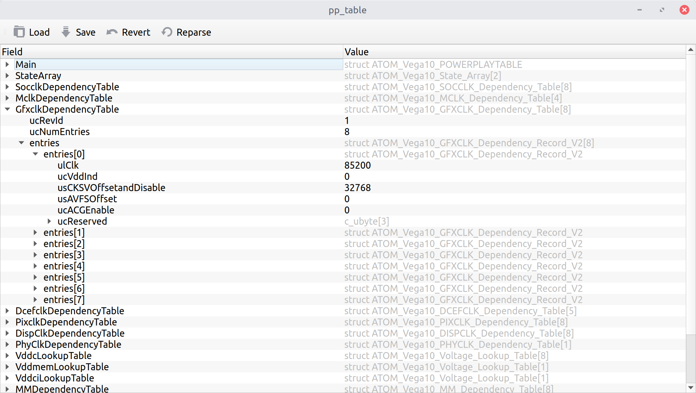

|Tests badge| |flake8 lint badge|

PowerPlay table editor
======================

A simple GUI tool to inspect and modify AMD GPU powerplay tables. Tries to
parse tables the same way as Linux driver does.

Installation
------------

Dependencies:

- Python 3.6 or later
- PyQt 5

On recent Debians/Ubuntus::

$ apt-get install python3-pyqt5 python3-pip git
$ pip3 install --user git+https://github.com/amezin/powerplay-table-editor.git

Usage
-----

GUI app::

$ amdgpu-pptable-editor

View current pptable::

$ amdgpu-pptable-editor /sys/class/drm/card*/device/pp_table

``pp_table`` is only writable by root, so you'll have to save the file to a
temporary location and then ``cp`` it back to
``/sys/class/drm/card*/device/pp_table``. Or use ``sudoedit``::

$ env EDITOR=amdgpu-pptable-editor sudoedit /sys/class/drm/card*/device/pp_table

.. Caution::
   You can completely screw up your card by modifying its pp_table.

.. |Tests badge| image:: https://github.com/amezin/powerplay-table-editor/workflows/Tests/badge.svg
.. |flake8 lint badge| image:: https://github.com/amezin/powerplay-table-editor/workflows/flake8%20lint/badge.svg
